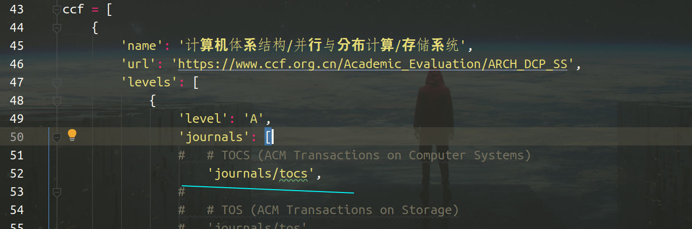

# 注释掉不需要爬的会议\期刊

ccf-crawler/paper_crawler/ccf.py文件第43行开始，比如我不需要下载计算机体系结构A类的tocs这个期刊，我就将'journals/tocs'这行注释 (人工智能和计算机体系结构这两个领域已经爬完了)



# 运行环境

- python3.6+
- mongodb

# 本地运行爬虫

需要部署好mongodb数据库并修改settings.py中的数据库配置

ccf-crawler目录下:

```bash
pip install -r requirements.txt -i https://pypi.tuna.tsinghua.edu.cn/simple/
python ccf_crawler.py
```


# docker中运行爬虫

需要部署好mongodb数据库并修改settings.py中的数据库配置

同样ccf-crawler目录下

```bash
# 创建镜像
docker build -t ccf_crawler .
# 创建启动容器
docker run --name ccf_crawler -d ccf_crawler 
```

# 如果使用代理池的话，建议先运行代理池几分钟，然后修改settings.py中代理池的配置，然后再运行爬虫

