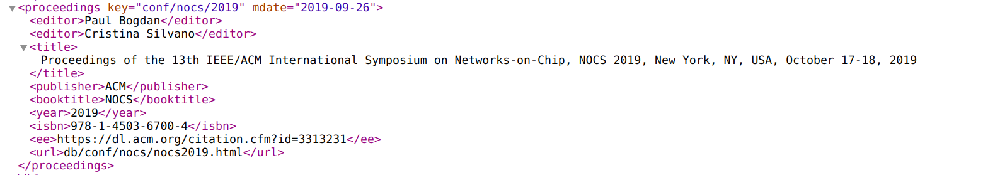
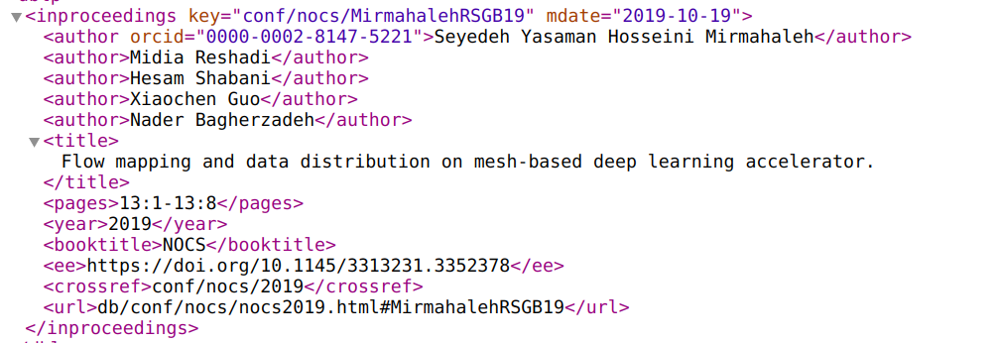
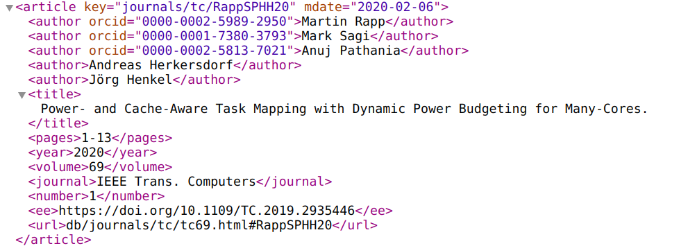
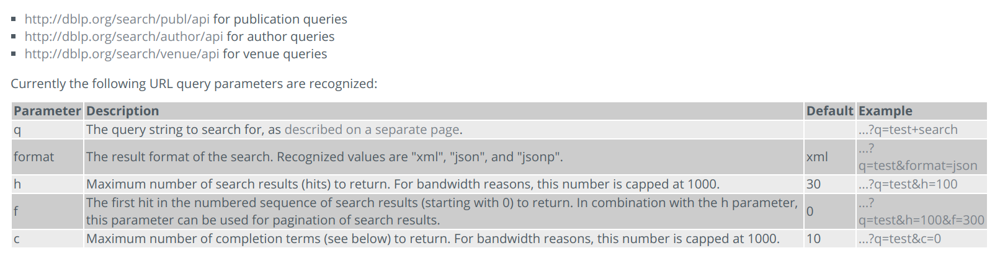
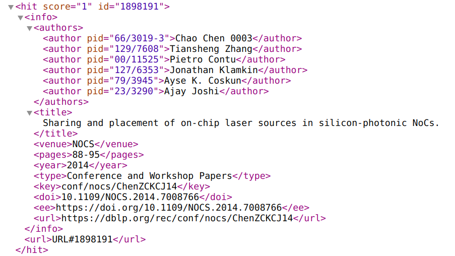
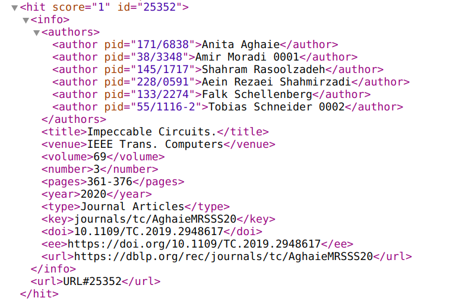
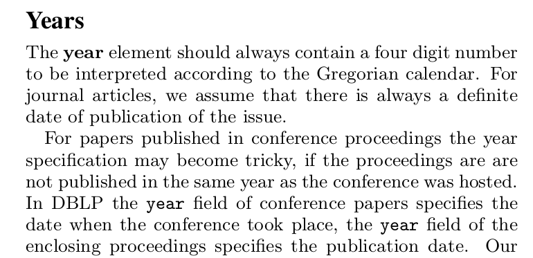

## dblp中名词

- proceedings	Conferences and Workshops的某次会议
- inproceedings     Conferences and Workshops里的一篇论文
- article    journals里的一篇论文

## 数据解析

### proceedings

​	

- proceedings.key    在dblp里面的唯一标识符
- proceedings.mdate    最后一次编辑时间
- publisher    出版商
- booktitle    会议名称（缩写）
- year    ==会议发表年份（不一定与会议执行年份一致，>=会议执行年份）==
- ee    该次会议在大出版商（IEEE、ACM等）上的链接

### inproceedings

​	

- inproceedings.key    该论文在dblp中的唯一标识符
- inproceedings.mdate    最后一次编辑时间
- author    作者
- author.orcid    ==作者的orcid，可以当做作者的唯一标识符，但不是每个作者都有==
- booktitle    会议名称（缩写）
- year    ==该论文所属会议执行年份，不一定是该论文发表年份==

### article

​	

- article.key
- article.mdate
- author
- author.orcid
- pages
- year    ==该论文发表的年份，dblp假设都是确切值==
- volume    journals的volume
- number    volume中的number
- journal   该论文所属期刊名称（缩写）

## search api

​	

#### 三个search api

- http://dblp.org/search/publ/api    用来搜索论文
- http://dblp.org/search/author/api    用来搜索作者
- http://dblp.org/search/venue/api    用来搜索会议\期刊

#### 五个参数

- q    搜索内容
- format    返回结果格式（json、xml...)
- h    返回结果的个数，即比如返回的xml文档内hits标签下子标签hit的个数，默认是30，上限为1000
- f    跳过前面多少个结果，结果都是通过对搜索内容的相关性以及在dblp中的id标识符排好序的；在结果大于1000时，可以设置为1000用于分页返回所有结果
- c    设置最大自动补全搜索内容的个数，最大为1000，默认是10

#### 自动补全搜索内容（search term）

​	会自动补全search term最右边的词，比如搜索term，会出现"**term**", "**term**s". "**term**inal", "**term**ination", "**term**inology"等补全，可以通过c参数来控制自动补全的个数

#### 搜索论文返回数据（hit）

​	

​	

- hit.id    可以当做该论文的标识符
- author.pid    author在dblp中的homepage，比如http://dblp.uni-trier.de/rec/pid/66/3019-3；==可以用来当author的标识符==
- author name    ==author name其实就可以作为标识符了，dblp对于同名作者大部分都做了添加后缀区分了，比如上图的'Amir Moradi 0001'，对于没有返回pid的情况，完全可以用该名字去search author api中搜索该作者==
- venue    该论文所属的会议\期刊名（缩写）
- type    是会议论文集中的论文还是期刊论文集中的论文，一般有'Conference and Workshop Papers' 和 'Journal Articles'这两个值
- doi    论文的doi
- volume
- number

## 存在问题

​	

​	就是在\<inproceedings\>记录中，\<year\>标签包含值表示conference的执行时间

​	在其他记录中，\<year\>标签中包含值表示该论文\论文集发表时间

## 参考链接

- https://dblp.uni-trier.de/faq/13501473
- https://dblp.uni-trier.de/xml/docu/dblpxml.pdf