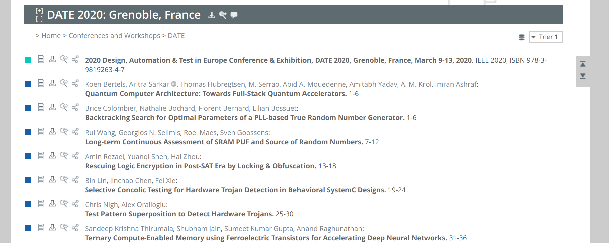

# 爬虫思路

## 1.从[ccf](https://www.ccf.org.cn/Academic_Evaluation/By_category/)获取每个领域的所有会议\期刊信息

主要是获取'journals/...'和'conf/...'，这两个用于在dblp中找到该会议或期刊

## 2. 从[dblp](https://dblp.uni-trier.de/db/)中以会议\期刊为单位获取所有论文并入库

### 每个会议\期刊在dblp中的url是'https://dblp.uni-trier.de/db/' + 上一步获取到的'journals/...'或'conf/...'，比如date这个会议，他的url就是'https://dblp.uni-trier.de/db/conf/date'

​	

### dblp这里因为会议和期刊的显示格式不一样，所以对于会议和期刊的解析规则是不一样的，具体看dblp.py这个文件（其实是忘了）；可能还有一些别的奇奇怪怪的显示格式，会导致无法成功爬取到论文，遇到这种情况的话，单独为其写解析函数处理就好了。

### 从dblp获取到的论文数据

关于dblp的搜索使用，可以参考dblp.md

有了这些基本数据还要再去IEEE、ACM等论文网站去获取abstract、references、citations、authors这些信息

## 3. 从论文网站获取论文的详细信息

​	若要下载pdf的话，需要校园网（因为学校买了它们的数据库，但是要控制访问频率，建议一个ip一分钟一两篇吧，如果爬取太快导致它们的服务出问题的话，学校查到你可能会找谈话）

### 如何在IEEE这些论文网站找到某论文

- 利用其网站的搜索功能，可以简单的只用title去搜索
- 在上一步中，从dblp中获取到某论文的基本信息后，就包括有该论文在这些论文网站的url地址

### 论文网站

- [aaai](https://aaai.org)

- [ACM](https://dl.acm.org)

- [Aminer](https://aminer.cn)

- [Elsevier](https://www.sciencedirect.com)

- [IEEE](https://ieeexplore.ieee.org/)

- [Researchgate](https://www.researchgate.net) 可以免费下载pdf

- [Springer](https://link.springer.com)

- [Usenix](https://www.usenix.org/)

	为上述网站都单独写了解析规则

​	当然还有[微软学术](https://academic.microsoft.com/home)等其他网站，可以自己再加上，不过大部分论文都是从IEEE、ACM中可以拿到。

## 数据入库

​	之前使用的是mongodb（方便数据的横向拓展），python中使用的数据库客户端是pymongo这个库，也基于这个库简单的进行了封装了一下，详见db.py

### 数据库配置：

### 

数据库这边代码耦合度比较高，如果要使用别的数据库，建议重写。

## 使用代理池

### 使用多线程

​	设置线程数量

​	

### 使用代理池

​	设置代理池

​	

​	之前是自己构建了一个免费代理池（从免费代理网站爬取暂时可用的高匿代理，好的情况下最多可以有几十个免费代理可用），详见proxy_pool/README.md，这部分代码耦合度也比较高。

## 存储哪些数据

​	详见data_model.py文件

## 遗留问题

​	最大的问题是内存泄露（找不到原因），所以设置了进程的内存上限，当内存占用超过上限时，重新启动爬虫进程。

​	设置爬虫进程最大内存：

